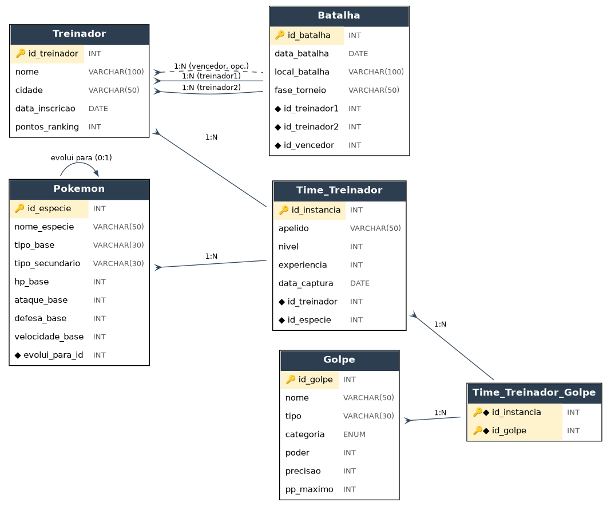

# Artefato 2: Esquema Relacional do Banco de Dados

## Diagrama de Entidade-Relacionamento (DER)

Abaixo está a representação visual das tabelas, colunas, chaves primárias (PK) e chaves estrangeiras (FK) que estruturam o sistema do Torneio Pokémon.

---

# Sobre as tabelas
Desenvolvemos um banco de dados composto por 6 tabelas principais: 
1. Treinador (dados de competidores)
2. Pokémon (catálogo de espécies)
3. Golpe (ataques que podem ser utilizados pelos Pokémon)
4. Time_Treinador (relação entre treinadores e seus Pokémon)
5. Batalha (histórico de confrontos do torneio)
6. Pokemon_Golpe (ligação entre Pokémon e seus golpes)

A estrutura foi projetada para separar os dados estáticos do universo Pokémon, como espécies, evoluções e golpes, dos dados dinâmicos do torneio, como participantes, equipes, confrontos e o histórico das batalhas.

---

# Sobre o esquema 
O esquema relacional do banco de dados Torneio Pokémon foi desenvolvido seguindo os princípios de normalização, atendendo às duas primeiras Formas Normais. 

### 1. Primeira Forma Normal (1FN)
A Primeira Forma Normal estabelece que todos os atributos de uma tabela devem conter valores atômicos e monovalorados, ou seja, cada campo deve armazenar apenas um único valor, sem listas, grupos repetitivos ou atributos compostos.

**Aplicação no projeto:** No contexto do torneio, um Pokémon pode aprender diversos golpes. Caso esses golpes fossem armazenados em colunas como golpe1, golpe2, golpe3 ou em uma única célula contendo vários valores separados por vírgulas, a 1FN seria violada.

**Solução:** Para evitar esse problema, foi criada a entidade Golpe, responsável por armazenar as informações de cada golpe, juntamente com a tabela associativa Pokemon_Golpe, que representa a relação entre Pokémon e golpes. Dessa forma, cada registro contém apenas valores atômicos, garantindo a conformidade com a Primeira Forma Normal.

### 2. Segunda Forma Normal (2FN)
A Segunda Forma Normal exige que a tabela esteja na 1FN e que todos os atributos não pertencentes à chave primária dependam integralmente da chave. Em tabelas com chave composta, nenhum atributo pode depender apenas de parte dessa chave.

**Aplicação no projeto:** As tabelas associativas Time_Treinador e Pokemon_Golpe utilizam chaves primárias compostas pelas chaves estrangeiras das entidades que relacionam:

- `Time_Treinador`: PRIMARY KEY (Treinador_id_treinador, Pokemon_id_especie)
- `Pokemon_Golpe`: PRIMARY KEY (Pokemon_id_especie, Golpe_id_golpe)

**Solução:** Essas tabelas possuem apenas a função de representar os relacionamentos entre as entidades e não armazenam atributos que dependam parcialmente da chave composta. Assim, todos os dados presentes dependem da chave como um todo, satisfazendo a Segunda Forma Normal. Já as demais tabelas (Treinador, Pokemon, Golpe e Batalha), por possuírem chaves primárias simples, atendem naturalmente aos requisitos da 2FN.